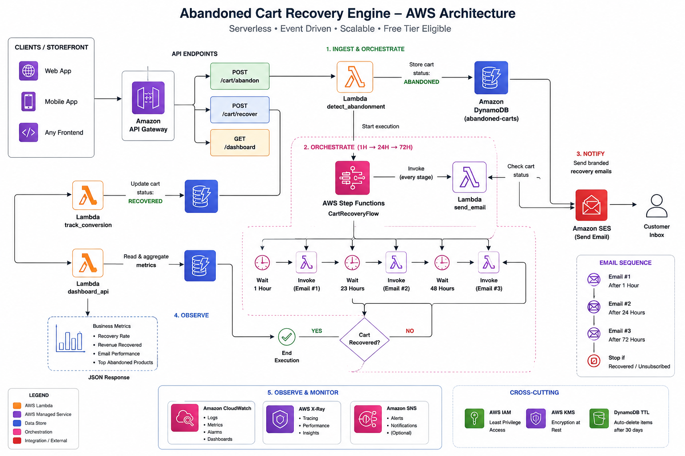
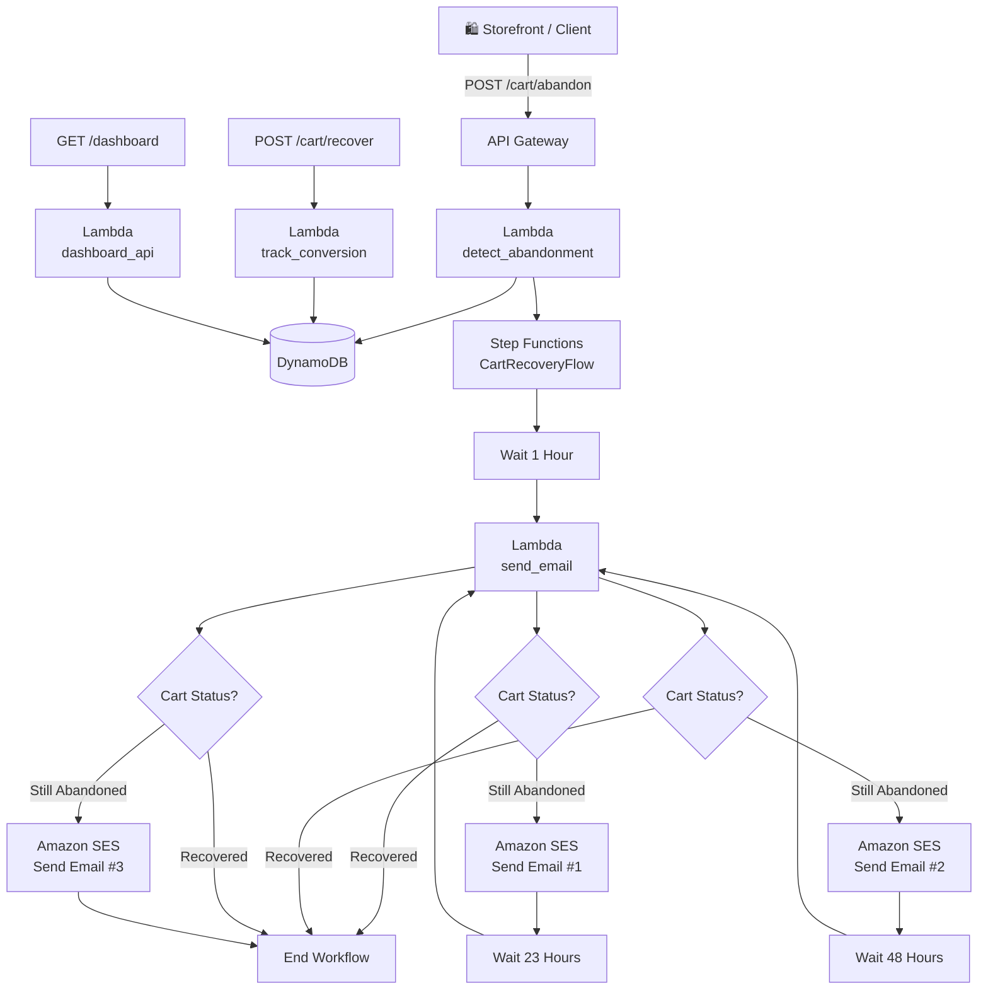
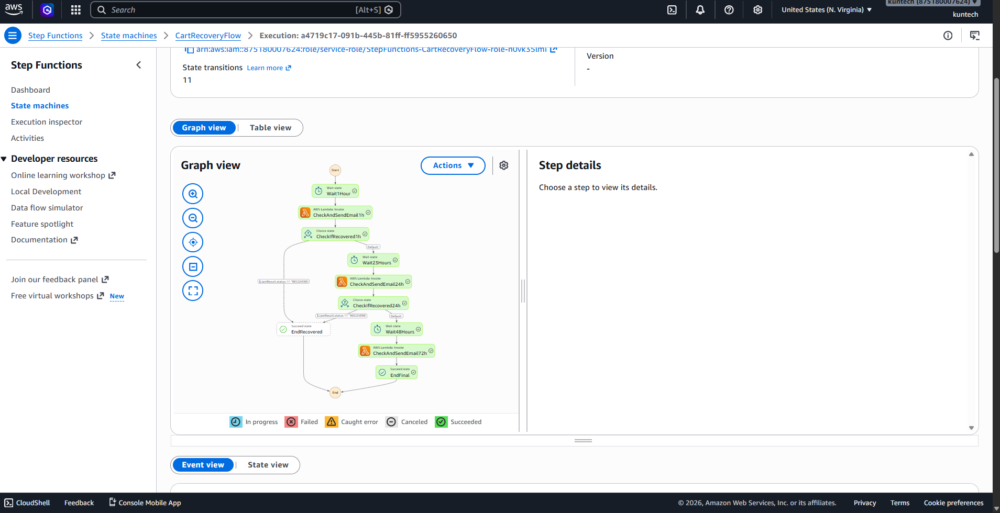
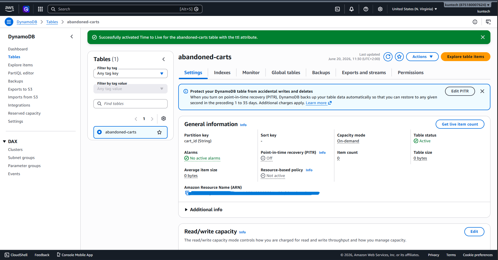
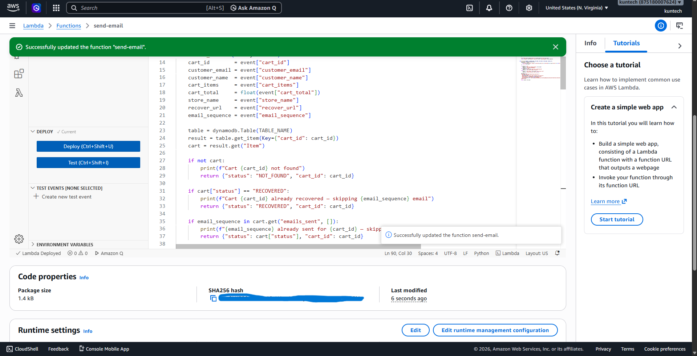

# 🛒 Abandoned Cart Recovery Engine
### Serverless AWS system

> This is the AWS-native version — fully serverless, production-grade reliability patterns, and $0 on the AWS free tier.

---

## 📌 The Problem This Solves

**70% of online shopping carts are abandoned.** For a store doing $100k/month in revenue, that's roughly $233k walking out the door every single month. The standard solution is a third-party tool like Klaviyo, Drip, or Omnisend — but these cost hundreds per month and lock your customer data onto someone else's servers.

This system replicates the core workflow entirely on AWS:
- Detects cart abandonment via a REST API any storefront can call
- Automatically sends a sequence of 3 recovery emails (1h → 24h → 72h)
- Stops the moment the customer purchases or unsubscribes — no unnecessary sends
- Tracks every email sent and every conversion back in DynamoDB
- Exposes a live business metrics dashboard via API

---

## 🏗️ Architecture



### How it works — 5 distinct jobs

| Job | Responsibility | AWS Service |
|-----|---------------|-------------|
| **Ingest** | Receive cart abandonment events from any storefront | API Gateway |
| **Persist** | Store cart state, email history, conversion data | DynamoDB |
| **Orchestrate** | Wait 1h/24h/72h without idle compute cost | Step Functions |
| **Notify** | Send branded HTML recovery emails | SES |
| **Observe** | Track recovery rate, revenue, email performance | CloudWatch + Dashboard API |

### Flow



---

## 💰 Cost Breakdown

| Service | Free Tier Limit | This Project Usage | Cost |
|---------|----------------|-------------------|------|
| API Gateway | 1M calls/month | ~100 test calls | **$0** |
| Lambda | 1M requests/month | ~500 invocations | **$0** |
| Step Functions | 4,000 transitions/month | ~30 transitions | **$0** |
| DynamoDB | 25GB storage | <1MB | **$0** |
| SES | 62,000 emails/month | ~10 test emails | **$0** |
| CloudWatch | 5GB logs, 10 metrics | Minimal | **$0** |
| **Total** | | | **$0.00** |

> Architecture replicates a $500–2,000/month SaaS tool (Klaviyo) at $0 infrastructure cost — demonstrating cost-conscious, free-tier-first AWS design.

---

## 📸 Live Demo

### Step Functions — Full execution running live


### Recovery email received in inbox


### DynamoDB — Cart state tracked in real time


### SES — Verified sender identity


---

## 📦 Project Structure

```
abandoned-cart-recovery/
├── lambdas/
│   ├── detect_abandonment/     # POST /cart/abandon → saves cart, starts Step Functions
│   │   └── handler.py
│   ├── send_email/             # Called by Step Functions → checks status, sends via SES
│   │   └── handler.py
│   ├── track_conversion/       # POST /cart/recover → marks cart RECOVERED
│   │   └── handler.py
│   └── dashboard_api/          # GET /dashboard → returns live business metrics
│       └── handler.py
├── sample_payloads/
│   ├── abandon_cart.json       # Test payload for POST /cart/abandon
│   └── recover_cart.json       # Test payload for POST /cart/recover
├── docs/
│   ├── SETUP.md                # Full step-by-step AWS Console deployment guide
│   └── diagrams/               # Architecture diagrams and demo screenshots
├── requirements.txt
├── .gitignore
└── README.md
```

---

## 🚀 Deploy It Yourself

Full step-by-step instructions → [docs/SETUP.md](docs/SETUP.md)

**Prerequisites:** AWS account (free tier), Python 3.11+, AWS CLI configured

**High-level steps:**
1. Verify a sending email in SES
2. Create `abandoned-carts` DynamoDB table (On-demand, with TTL enabled)
3. Deploy `send_email` Lambda + add env vars + attach DynamoDB/SES policies
4. Create `CartRecoveryFlow` Step Functions state machine with the provided JSON definition
5. Deploy `detect_abandonment`, `track_conversion`, `dashboard_api` Lambdas
6. Wire up API Gateway with 3 routes
7. Test end-to-end with sample payloads

---

## 🧪 Test It

```bash
# 1. Abandon a cart
curl -X POST https://YOUR_API_ID.execute-api.us-east-1.amazonaws.com/prod/cart/abandon \
  -H "Content-Type: application/json" \
  -d @sample_payloads/abandon_cart.json

# 2. Check recovery metrics
curl https://YOUR_API_ID.execute-api.us-east-1.amazonaws.com/prod/dashboard

# 3. Simulate a purchase (stops further emails)
curl -X POST https://YOUR_API_ID.execute-api.us-east-1.amazonaws.com/prod/cart/recover \
  -H "Content-Type: application/json" \
  -d @sample_payloads/recover_cart.json
```

---

## 📊 Dashboard Response

```json
{
  "summary": {
    "total_abandoned": 1247,
    "total_recovered": 312,
    "recovery_rate": "25.0%",
    "estimated_revenue_recovered": "$18,720.00"
  },
  "email_performance": {
    "email_1h":  { "sent": 1247, "converted": 187, "conversion_rate": "15.0%" },
    "email_24h": { "sent": 1060, "converted": 93,  "conversion_rate": "8.8%"  },
    "email_72h": { "sent": 967,  "converted": 32,  "conversion_rate": "3.3%"  }
  },
  "top_abandoned_products": [
    { "product_id": "SKU-1042", "name": "Running Shoes Pro", "abandoned_count": 89 }
  ]
}
```

---

## 🔒 Production-Ready Patterns Used

- **Idempotency** — DynamoDB `ConditionExpression` on `put_item` prevents duplicate cart entries; `emails_sent` list prevents duplicate sends on Lambda retry
- **Dead-letter handling** — `send_email` checks cart status before every send; if already RECOVERED, it exits cleanly without sending
- **GDPR compliance** — DynamoDB TTL auto-deletes cart records after 30 days
- **No idle compute** — fully serverless; zero cost when not processing events
- **Least-privilege IAM** — each Lambda role has only the permissions it needs (note: broadened to FullAccess policies for this demo; scope down per-resource for production)

---

## 🛠️ AWS Services Used

`Lambda` `API Gateway` `Step Functions` `DynamoDB` `SES` `CloudWatch` `IAM`

---

*Built by Kundai Muchemwa — AWS Solutions Architect Associate*
*Part of AWS Portfolio Projects series — all projects built on free tier*

