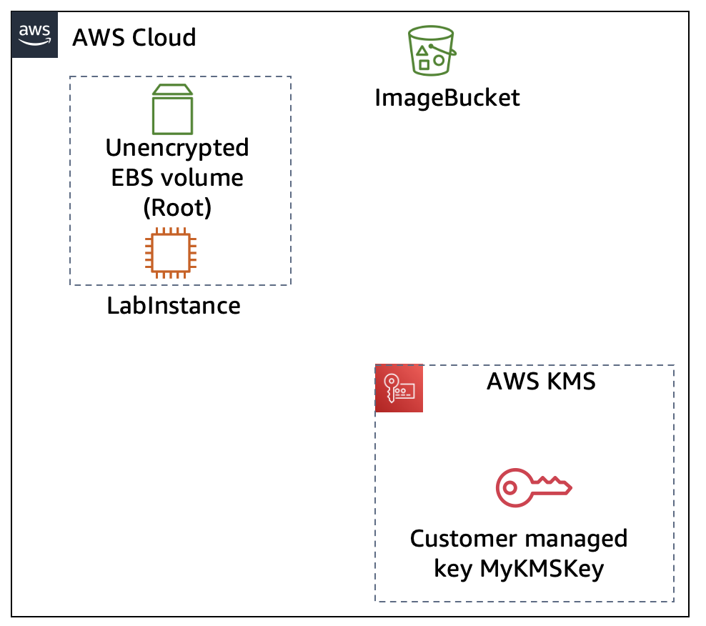
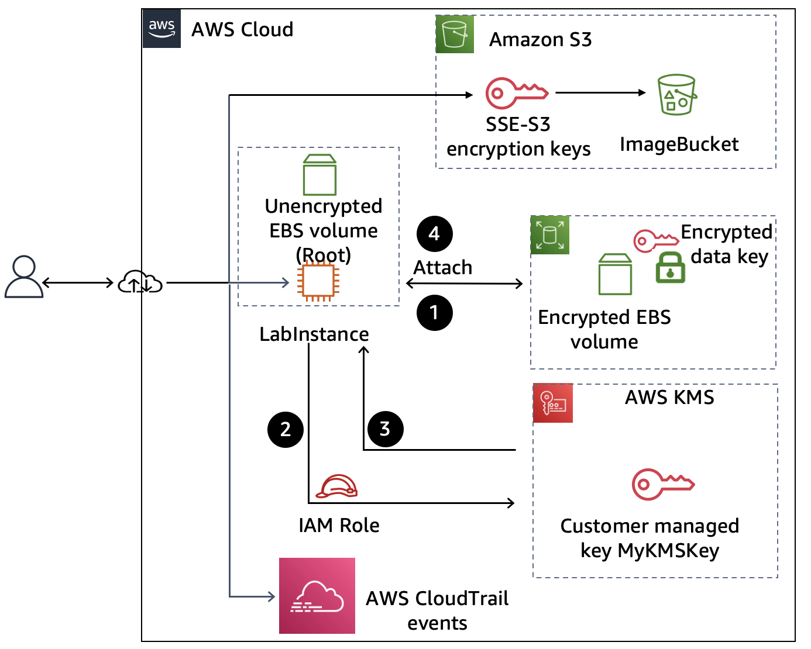

Encrypting Data at Rest with AWS Encryption Options
Overview

Securing sensitive information is a critical part of cloud security. AWS provides several encryption options that protect data at rest across storage and compute services.

In this project, I implemented encryption using both default AWS encryption mechanisms and customer managed keys (CMKs) in AWS Key Management Service (KMS). I applied encryption to Amazon S3 objects and Amazon EBS volumes, and monitored encryption activities using AWS CloudTrail.

This project demonstrates how encryption impacts data access and how disabling or rotating encryption keys affects workloads in AWS.

Objectives

✅ Reviewed default encryption provided by Amazon S3
✅ Accessed an encrypted Amazon S3 object
✅ Created an AWS KMS customer managed key (CMK)
✅ Encrypted and attached an Amazon EBS volume to an EC2 instance
✅ Disabled and re-enabled a KMS key and observed access effects
✅ Monitored encryption key usage with AWS CloudTrail event history
✅ Reviewed KMS key rotation policies

Scenario

A company wants to ensure that all stored data is encrypted at rest to meet compliance and security requirements. The tasks included:

✅ Validating default S3 encryption for uploaded objects
✅ Creating a KMS key to enforce customer-managed encryption policies
✅ Encrypting block storage (EBS volumes) attached to EC2 instances
✅ Demonstrating how disabling a key blocks access to encrypted data
✅ Auditing key usage via CloudTrail logs
✅ Reviewing key lifecycle management through rotation policies

Architecture
Starting Architecture

## 🏗 Architecture Diagram

✅ Data stored in Amazon S3 is encrypted using default AWS-managed keys
✅ EC2 instances use unencrypted EBS volumes
✅ No centralized monitoring of encryption key usage

## Final Architecture

✅ Amazon S3 objects encrypted with both default and customer-managed keys
✅ Amazon EBS volume attached to an EC2 instance, encrypted using a KMS CMK
✅ AWS KMS provides centralized key management
✅ AWS CloudTrail monitors key usage events and access attempts
✅ Disabling/re-enabling keys directly impacts access to encrypted resources

Key AWS Services Used

✅ Amazon S3 – Object storage with default and KMS-based encryption
✅ Amazon EBS – Encrypted volumes for EC2 instances
✅ Amazon EC2 – Compute service to attach and test encrypted storage
✅ AWS KMS – Customer managed keys (CMKs) for encryption/decryption
✅ AWS CloudTrail – Audit logs of key usage and access patterns

Lessons Learned

✅ How default encryption differs from customer-managed encryption in S3
✅ The process of creating and using KMS CMKs for EBS and S3
✅ How disabling a KMS key immediately blocks access to encrypted resources
✅ The importance of CloudTrail logs for auditing encryption activity
✅ Benefits of enabling automatic key rotation to strengthen security posture

Next Steps

✅ Explore cross-account KMS key usage for multi-team collaboration
✅ Enable AWS Config to continuously monitor encryption compliance
✅ Implement AWS Secrets Manager to securely store application secrets
✅ Extend encryption use cases to RDS databases and EFS file systems
