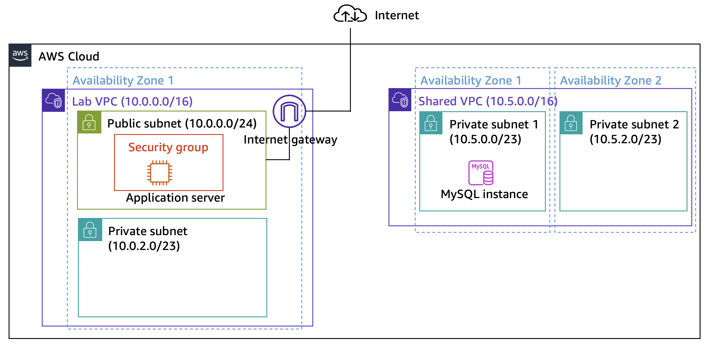

## Creating a VPC Peering Connection

In modern cloud architectures, it is often necessary to connect multiple Virtual Private Clouds (VPCs) in order to enable secure and efficient data transfer between applications, services, or environments. This project demonstrates the process of creating a **VPC peering connection** between two VPCs and configuring the supporting components required for successful communication.

This implementation showcases fundamental AWS networking concepts while also emphasizing **observability** through the use of VPC Flow Logs for monitoring and analysis.

<p align="center">
  
</p>

---

## Objectives

* ✅ **Create a VPC Peering Connection** between two VPCs.
* ✅ **Configure route tables** to enable cross-VPC communication.
* ✅ **Enable VPC Flow Logs** to gain insights into traffic patterns and network activity.
* ✅ **Test connectivity** between instances across the peered VPCs.
* ✅ **Analyze flow logs** to confirm allowed/denied traffic and validate security controls.

---

## Key Deliverables

* A functional **VPC Peering connection** linking two isolated networks.
* **Route tables** configured for proper cross-VPC traffic flow.
* **Flow Logs** capturing accepted and rejected network traffic.
* **Test results and screenshots** demonstrating successful connectivity.

---

## Folder Structure

```
01-vpc-peering-connection/
├── README.md            # This file
└── images/              # Screenshots (architecture diagram, flow logs, tests)
```

---

## Notes

This project is part of my **AWS Projects Portfolio**, showcasing practical, real-world AWS solutions for networking and observability. It highlights best practices for:

* Non-overlapping CIDR allocations
* Route table updates
* Security group and NACL considerations
* Network traffic analysis with Flow Logs

---

## Next Steps

Future enhancements may include:

* Automating the setup with **AWS CLI scripts** or **Terraform**
* Enabling **Athena queries on Flow Logs** for deeper traffic analysis
* Demonstrating **cross-account VPC peering** scenarios

